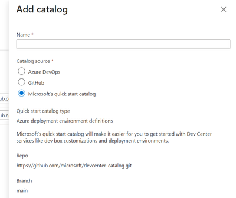

# Demo for Azure Deployment Env & Azure Dev Box

This repo helps to setup a demo of Azure Deployment Environment and Azure Dev Box [with customization](https://techcommunity.microsoft.com/t5/microsoft-developer-community/accelerate-developer-onboarding-with-the-configuration-as-code/ba-p/4062416)

# Installation

1. Run the [Github Action workflow](https://github.com/lgmorand/azure-ade-devbox/actions/workflows/demo.yaml) to provision a workflow

2. Add the quickstart repository (I didn't find a way to add it with CLI) 

    - Go to the Azure portal, and navigate to your dev center.
    - In the left menu under Environment configuration, select Catalogs, and then select Add.
    - In Add catalog, pick “Microsoft’s quick start catalog” and “Dev box customization tasks” as the quick start catalog type. Then, select Add:
    - In Catalogs for the dev center, verify that your catalog appears. If the connection is successful, Status is Connected.

# Demo

1. Go on the [Developer portal](https://devportal.microsoft.com/)

2. Create a DevBox. Select and upload a customization file. One can be found [here](./DevBox/project-orchard.yaml)

3. Wait for the creation of the DevBox. Can take up to 25min.
